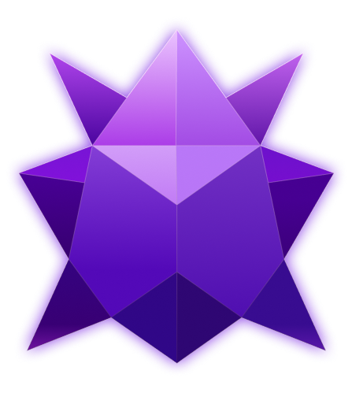

<div align="center">



# Nexo

**A real-time chat app — now with channels, a native desktop client, and auto-updates.**

Built with Next.js, TypeScript, Firebase, and Electron.

</div>

---

## ✨ Features

### Messaging
- **Real-time messaging** — 1-on-1 and group chats powered by Firestore subscriptions
- **Optimistic sending** — messages appear instantly and reconcile seamlessly once confirmed
- **Message tools** — editing, forwarding (with a dedicated forward picker), deletion, pinning, emoji reactions, and read receipts
- **Custom stickers** — a full sticker/emoji system with Cloudinary-hosted assets, rendered without a bubble background
- **Unread badges** — per-recipient unread counters with race-condition-safe read marking

### Channels 📢
- **Telegram-style channels** — create channels, publish posts, and broadcast to subscribers
- **View counters** — real-time, dwell-time-aware view tracking on every post
- **Comments** — full-screen threaded comments with subscriber-gated input
- **Post management** — edit, pin, and delete posts with an inline editor and a pinned-post banner
- **Unified sidebar** — chats and channels merged into one recency-sorted list, with drag-and-drop reordering

### Profiles & customization
- **Custom profiles** — editable avatars and banners with built-in image cropping
- **Avatar decorations & borders**, plus a custom profile card color
- **Gift system** — collectible gifts with rarity tiers, animated details, and a floating "gift cloud" on the full profile view, with a featured-gift badge next to usernames
- **Theming** — dark, light, and fully custom themes synced across devices via Firestore

### UX details
- **Presence** — online/offline status with last-seen timestamps
- **Context menus** — right-click actions (pin, mark as read, delete/leave) across chats and channels
- **Custom desktop notifications** — a native, frameless, always-on-top toast window with mouse passthrough

### Desktop app 🖥️
- **Native Windows app** — packaged with Electron + electron-builder (NSIS installer)
- **Auto-updates** — full GitHub Releases integration with a `/download` page on the web app
- **Robust IPC layer** — hardened against version mismatches between old and new builds

---

## 🛠️ Tech stack

| Layer | Tech |
|---|---|
| Framework | Next.js (App Router) |
| Language | TypeScript |
| Styling | Tailwind CSS v4 |
| State management | Zustand |
| Backend | Firebase (Authentication, Firestore) |
| Desktop shell | Electron + electron-builder |
| Media storage | Cloudinary |
| Icons | Lucide React |

---

## 🚀 Getting started

### Prerequisites
- Node.js 18+
- A Firebase project (Auth + Firestore enabled)
- A Cloudinary account with an unsigned upload preset

### Installation
```bash
git clone https://github.com/m1tywaflow/chat.git
cd chat
npm install
```

### Environment variables
Create a `.env.local` file in the project root:
```env
NEXT_PUBLIC_FIREBASE_API_KEY=
NEXT_PUBLIC_FIREBASE_AUTH_DOMAIN=
NEXT_PUBLIC_FIREBASE_PROJECT_ID=
NEXT_PUBLIC_FIREBASE_STORAGE_BUCKET=
NEXT_PUBLIC_FIREBASE_MESSAGING_SENDER_ID=
NEXT_PUBLIC_FIREBASE_APP_ID=
```
Cloudinary cloud name and upload preset are configured directly in the code.

### Run locally (web)
```bash
npm run dev
```
The app will be available at `http://localhost:3000`.

### Run the desktop app (Electron)
```bash
npm run electron:dev
```

### Build the Windows installer
```bash
npm run electron:build
```
Publishing a new release (with auto-update support):
```bash
npm run electron:build -- --publish always
```

---

## 📁 Project structure
```
src/
  app/              Next.js App Router pages (incl. /download)
  components/       UI components (chat, channels, profile, gifts, theming, etc.)
  lib/              Firebase config, gifts data, avatar decorations, utilities
  store/            Zustand stores (chat, channel, theme, etc.)
electron/
  main/             Main process — windows, notifications, auto-updater, IPC
  preload/          Preload scripts exposing a safe renderer API
```

---

## 📌 Roadmap ideas
- Voice messages
- Message search
- Mobile companion app

---

## 📄 License
This project is for personal/portfolio use.
