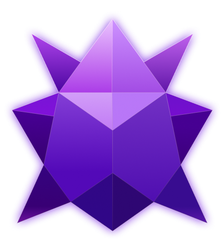

<div align="center">



# Nexo

### Communication, redesigned.

A modern communication platform for **messaging, communities, voice & video calls, and personalization**.

**Chat · Connect · Call · Share**

[](https://github.com/m1tywaflow/chat/stargazers)
[](https://github.com/m1tywaflow/chat/network/members)
[](https://github.com/m1tywaflow/chat/blob/main/LICENSE)

<br />

[**Live Demo →**](https://chat-vert-nu-34.vercel.app/)

</div>

---

## Overview

**Nexo** is a modern communication platform that brings **private messaging, group conversations, channels, voice & video calls, profiles, themes, and a native desktop client** into one place.

The project is built around a fast, responsive interface with real-time synchronization and cross-platform communication.

### Built with

**Next.js · TypeScript · Firebase · LiveKit · Cloudinary · Electron**

---

## Features

|     | Feature           | Description                                                                        |
| --- | ----------------- | ---------------------------------------------------------------------------------- |
| 💬  | **Chats**         | Private and group conversations with rich messaging, reactions, replies, and media |
| 📢  | **Channels**      | Public channels with posts, discussions, subscribers, reactions, and sharing       |
| 📞  | **Voice & Video** | Real-time audio and video calls powered by LiveKit                                 |
| 👤  | **Profiles**      | Avatars, banners, decorations, colors, and collectible gifts                       |
| 🎨  | **Themes**        | Dark, light, and custom themes with personalization options                        |
| 🖥️ | **Desktop**       | Native Windows application with notifications and automatic updates                |

---

## Messaging

Nexo provides a full messaging experience for both private and group conversations.

* Private & group conversations
* Real-time message synchronization
* Message editing & deletion
* Message forwarding
* Pinned messages
* Emoji reactions
* Read receipts
* Voice messages
* Image & media sharing
* Replies and rich message content
* Unread message indicators

---

## Channels

Channels provide a dedicated space for publishing and discussing content.

* Public channels
* Posts and discussions
* Subscriber management
* Reactions
* View counters
* Pinned posts
* Content forwarding
* Media sharing

---

## Profiles & Personalization

Nexo goes beyond messaging with customizable profiles and interface personalization.

* Custom avatars
* Profile banners
* Profile decorations
* Custom colors
* Collectible gifts
* Dark & light themes
* Custom themes

---

## Voice & Video

Real-time communication is powered by **LiveKit**.

* Voice calls
* Video calls
* Real-time audio & video
* Call controls
* Conversation-based calls

---

## Desktop

Nexo includes a dedicated **Windows desktop application built with Electron**.

* Native Windows application
* Desktop notifications
* Automatic updates
* NSIS installer
* GitHub Releases integration
* Secure IPC communication

---

## Architecture

Nexo uses **Firebase Firestore** for real-time synchronization of conversations and user state, combined with optimistic updates for a responsive experience.

**LiveKit** handles real-time voice and video communication, while **Cloudinary** provides media storage, processing, and delivery.

```text
                         ┌────────────────────┐
                         │       Nexo         │
                         │   Next.js / TS     │
                         └─────────┬──────────┘
                                   │
              ┌────────────────────┼────────────────────┐
              ▼                    ▼                    ▼
       ┌──────────────┐     ┌──────────────┐     ┌──────────────┐
       │   Firebase   │     │   LiveKit    │     │  Cloudinary  │
       │              │     │              │     │              │
       │ Auth /       │     │ Voice /      │     │ Images /     │
       │ Firestore    │     │ Video        │     │ Media        │
       └──────────────┘     └──────────────┘     └──────────────┘
                                   │
                                   ▼
                         ┌────────────────────┐
                         │     Electron       │
                         │    Windows App     │
                         └────────────────────┘
```

---

## Technology

| Category             | Technology              |
| -------------------- | ----------------------- |
| **Framework**        | Next.js · App Router    |
| **Language**         | TypeScript              |
| **Styling**          | Tailwind CSS v4         |
| **State Management** | Zustand                 |
| **Backend**          | Firebase                |
| **Database**         | Cloud Firestore         |
| **Authentication**   | Firebase Auth           |
| **Voice & Video**    | LiveKit                 |
| **Media**            | Cloudinary              |
| **Desktop**          | Electron                |
| **Packaging**        | electron-builder · NSIS |
| **Deployment**       | Vercel                  |

---

## Project Structure

```text
src/
├── app/            # Next.js routes and pages
├── components/     # UI components
├── hooks/          # React hooks
├── lib/            # Firebase, LiveKit and utility logic
├── stores/         # Zustand stores
└── types/          # TypeScript types

electron/
└── main.js         # Electron main process

public/
└── logo.png        # Nexo branding
```

---

## Development

### 1. Clone the repository

```bash
git clone https://github.com/m1tywaflow/chat.git
cd chat
```

### 2. Install dependencies

```bash
npm install
```

### 3. Configure environment variables

Create a `.env.local` file and add your Firebase, Cloudinary, and LiveKit configuration.

### 4. Start the development server

```bash
npm run dev
```

The application will be available at:

```text
http://localhost:3000
```

---

## Build

Create a production build:

```bash
npm run build
```

Build the Windows desktop application:

```bash
npm run dist
```

---

## Screenshots

<div align="center">

<!-- Add screenshots here -->


<br /><br />


</div>

---

## Roadmap

* [x] Private messaging
* [x] Group conversations
* [x] Channels
* [x] Voice & video calls
* [x] Profiles & customization
* [x] Themes
* [x] Windows desktop client
* [x] Automatic desktop updates
* [ ] More personalization features
* [ ] Additional desktop features
* [ ] Further performance improvements

---

## License

This project is licensed under the **MIT License**.

See the [LICENSE](LICENSE) file for details.

---

<div align="center">


### Nexo

**Communication, redesigned.**

[**Open Nexo →**](https://chat-vert-nu-34.vercel.app/)

<br />

Made with ❤️ using Next.js, TypeScript, Firebase, LiveKit, Cloudinary and Electron.

</div>
